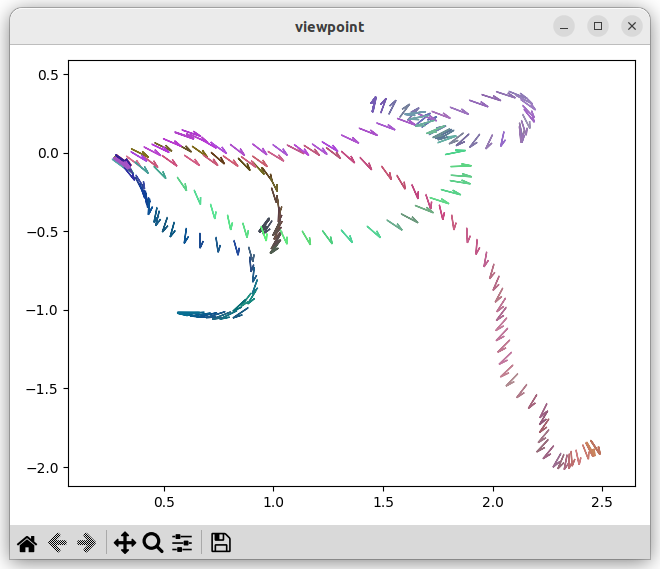

## Dimension Reduction Techniques

#### PCA
```python
class PCA:
    def __init__(self, profile=None, n=3):
        try:
            with open(profile, "rb") as f:
                _profile = pickle.load(f)
            [self.mean, self.std, self.top_evec] = _profile
        except: print("No profile data, use .fit to fit data")

    def fit(self, data, fn=None, n=3):
        data_pca = None
        vec = self.preprocess(data)
        vec = vec.to_numpy()
        self.mean = np.mean(vec, axis=0)
        self.std = np.std(vec, axis=0)
        vec_std = (vec - self.mean) / self.std
        self.cov = np.cov(vec_std, rowvar=False)
        self.eival, self.eivec = np.linalg.eig(self.cov)
        self.ind = np.argsort(self.eival)[::-1]
        sorted_eigenvectors = self.eivec[:, self.ind]
        self.top_evec = sorted_eigenvectors[:, :n]
        self.data_pca = np.dot(vec_std, self.top_evec)
        if fn is None:
            if not os.path.exists('./result'): os.makedirs('./result')
            t = datetime.datetime.now().strftime("%Y-%m-%d_%H-%M-%S")
            fn='./result/pca_profile_'+str(t)+'.pkl'
            with open(fn,"wb") as f:
                pickle.dump([self.mean, self.std, self.top_evec], f)
            print('Profile saved at :', fn)
        else: 
            with open(fn,"wb") as f:
                pickle.dump([self.mean, self.std, self.top_evec], f)
        self.data_pca = pd.DataFrame(self.data_pca, columns=['pca0', 'pca1', 'pca2'])
        print('min :', self.data_pca.min(axis=0))
        print('max :', self.data_pca.max(axis=0))
        
        return pd.concat([data, self.data_pca], axis=1)

    def preprocess(self, df_f):
        # get vectors from df_f
        df_out = pd.DataFrame({col: df_f[col] for col in df_f.columns if isinstance(col, int)})
        return df_out

    def standardize(self, data):
        data = self.preprocess(data)
        return (data - self.mean) / self.std
    
    def transform(self, data):
        data_std = self.standardize(data)
        self.n_data_pca = np.dot(data_std, self.top_evec)
        self.n_data_pca = pd.DataFrame(self.n_data_pca, columns=['pca0', 'pca1', 'pca2'])
        print('min :', self.n_data_pca.min(axis=0))
        print('max :', self.n_data_pca.max(axis=0))
        return pd.concat([data, self.n_data_pca], axis=1)
```
[Jupyter demo](https://github.com/blu-y/cmap/blob/main/ex/dim_reduct_pca.ipynb)  
  
##### Result
잘 나오긴 하였으나, 좌표계가 room 마다 새로시작되는 것 같음.
data의 좌표가 같은 home에서 이어져 있는지 살펴볼 필요가 있음


##### Explained Variance Ratio

#### NMF
```python

```
#### SVD
```python

```
#### ICA
```python

```