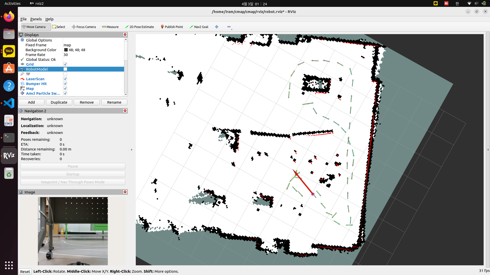
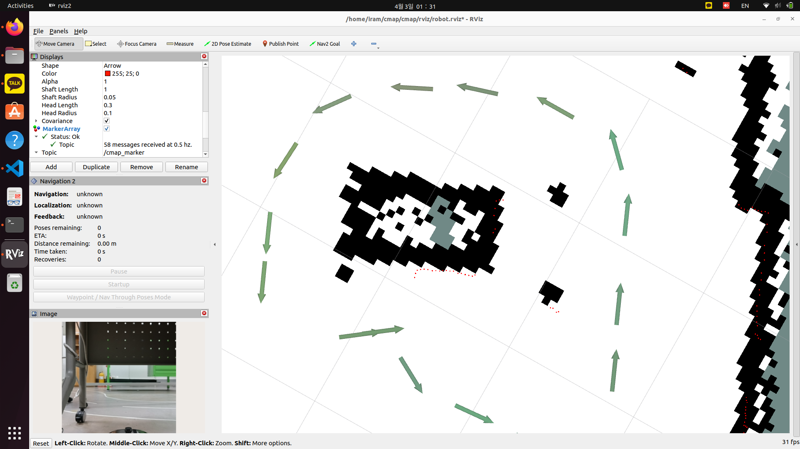

## Cmap Node
#### from Turtlebot
```
ros2 launch turtlebot4_navigation slam.launch.py
```
```
ros2 launch ~/cmap/cmap/launch/run.launch.py
```
```
python ./cmap/src/cmap_node.py 
```

#### from bag
```
ros2 bag play <bag_file> --clock
```
```
ros2 launch ~/cmap/cmap/launch/run.launch.py
```
```
python ./cmap/src/cmap_node.py 
```

#### Result
 
 