## Initial Setting (ROS, Turtle, etc.)
```
wget https://raw.githubusercontent.com/blu-y/turtle/main/autoset.sh
bash autoset.sh
source ~/.bashrc
```

## Robot@Home2 Dataset
[Dataset Page](https://zenodo.org/records/7811795)
#### Download Data
```
git clone https://github.com/blu-y/cmap.git
cd cmap
mkdir -p dataset/files
cd dataset
wget https://zenodo.org/records/7811795/files/Robot%40Home2_files.tgz?download=1
wget https://zenodo.org/records/7811795/files/Robot%40Home2_db.tgz?download=1
md5sum Robot@Home2_db.tgz Robot@Home2_files.tgz
```
Check md5 checksum:
```
d34fb44c01f31c87be8ab14e5ecd0767  Robot@Home2_db.tgz
c55465536738ec3470c75e1671bab5f2  Robot@Home2_files.tgz
```
#### Unzip
```
pv Robot@Home2_db.tgz | tar -xzf - -C .
pv Robot@Home2_files.tgz | tar -xzf - -C ./files
```

## CLIP Model Setting
#### Model Download
##### ViT-B-16-SigLIP-webli
[Model Page](https://huggingface.co/timm/ViT-B-16-SigLIP)
```
cd cmap/ViT-B-16-SigLIP
wget https://huggingface.co/timm/ViT-B-16-SigLIP/resolve/main/open_clip_pytorch_model.bin
```
##### ViT-B-32-256-datacomp-s34b-b86k
[Model Page](https://huggingface.co/laion/CLIP-ViT-B-32-256x256-DataComp-s34B-b86K)
```
cd cmap/Vit-B-32-256
wget https://huggingface.co/laion/CLIP-ViT-B-32-256x256-DataComp-s34B-b86K/resolve/main/open_clip_pytorch_model.bin
```

#### Environment Setting
##### Anaconda
```
cd ~/Downloads
wget https://repo.anaconda.com/archive/Anaconda3-2023.09-0-Linux-x86_64.sh
bash Anaconda3-2023.09-0-Linux-x86_64.sh
echo 'export PATH="$PATH:$HOME/anaconda3/bin"' >> ~/.bashrc
source ~/.bashrc
conda init
source ~/.bashrc
```
##### CUDA
```
sudo apt-get purge nvidia* -y
sudo apt-get autoremove -y
sudo apt-get autoclean -y
sudo reboot
sudo add-apt-repository ppa:graphics-drivers/ppa
sudo apt update
sudo apt install nvidia-driver-525
sudo apt update
sudo apt upgrade
sudo reboot
wget https://developer.download.nvidia.com/compute/cuda/11.8.0/local_installers/cuda_11.8.0_520.61.05_linux.run
sudo sh cuda_11.8.0_520.61.05_linux.run
echo 'export PATH="$PATH:/usr/local/cuda-11.8/bin"' >> ~/.bashrc
echo 'export LD_LIBRARY_PATH=$LD_LIBRARY_PATH:/usr/local/cuda-11.8/lib64/' >> ~/.bashrc
source ~/.bashrc
nvcc -V
sudo reboot
```
##### cuDNN [다운로드](https://developer.nvidia.com/rdp/cudnn-archive)
```
cd ~/Downloads
tar -xvf cudnn-linux-x86_64-8.9.7.29_cuda11-archive.tar.xz
sudo cp cudnn-*-archive/include/cudnn*.h /usr/local/cuda/include 
sudo cp -P cudnn-*-archive/lib/libcudnn* /usr/local/cuda/lib64 
sudo chmod a+r /usr/local/cuda/include/cudnn*.h /usr/local/cuda/lib64/libcudnn*
/usr/local/cuda-11.8/extras/demo_suite/deviceQuery
conda create -n cmap python=3.10
conda activate cmap
conda install pytorch torchvision torchaudio pytorch-cuda=11.8 -c pytorch -c nvidia
cd ~/cmap
pip install -r requirements.txt
```

## Semi-experiment: CLIP inference test
```
pip install ipywidgets # for jupyter
```
Jupyter demo [🔗](https://github.com/blu-y/cmap/blob/main/ex/semi_exp.ipynb)

Init model
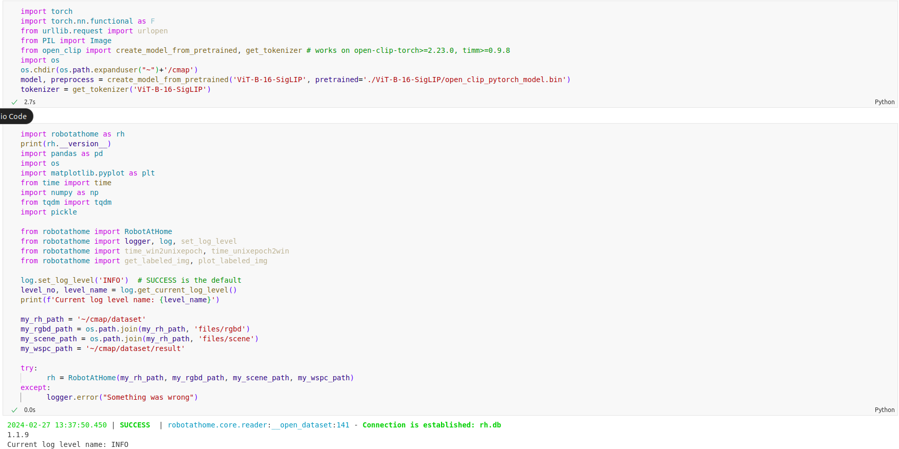
Rawdata
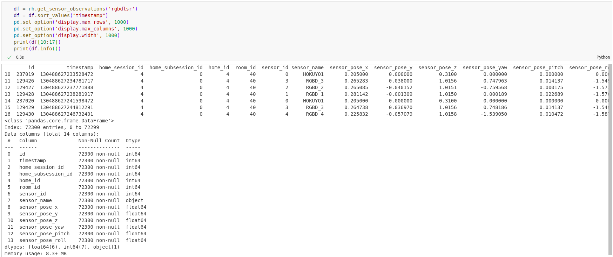
RGBD data
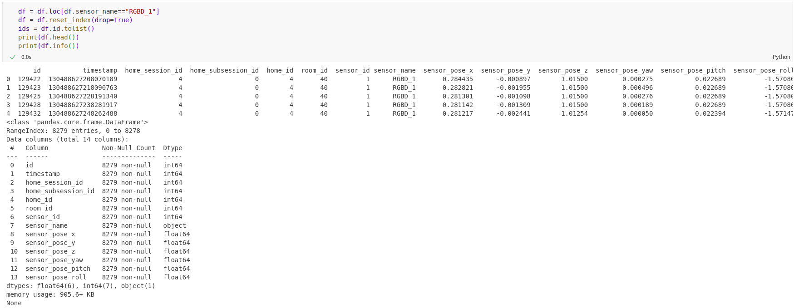
Run Clip
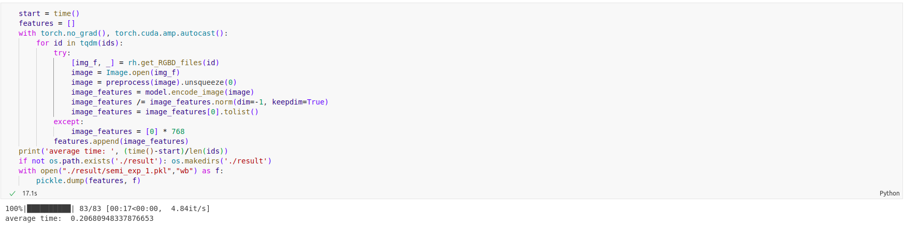
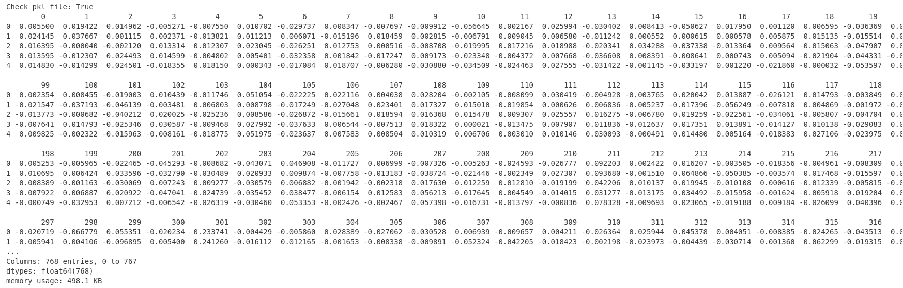

Result
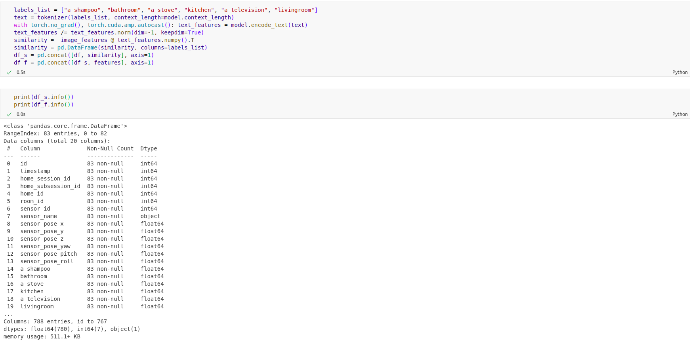
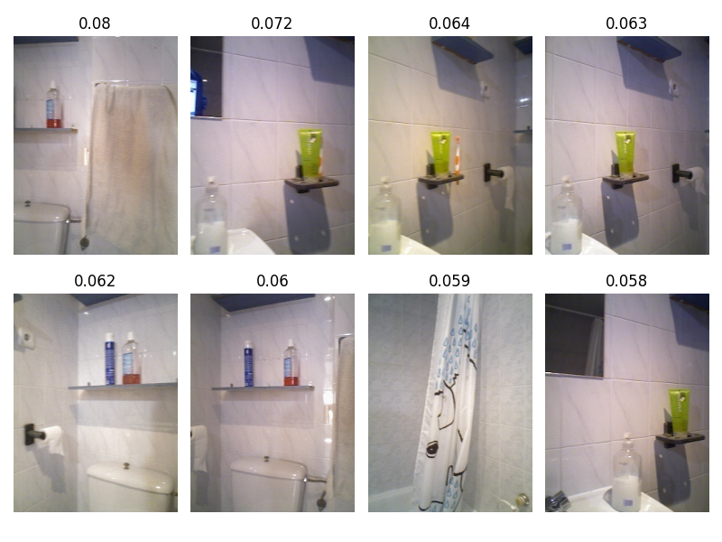
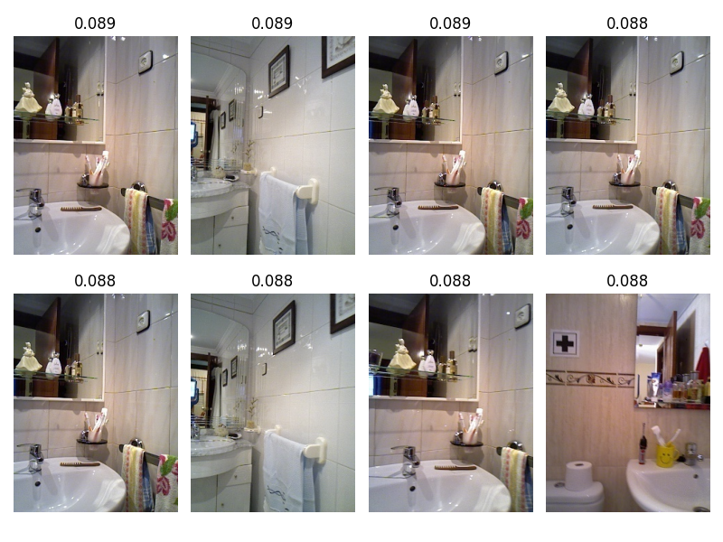
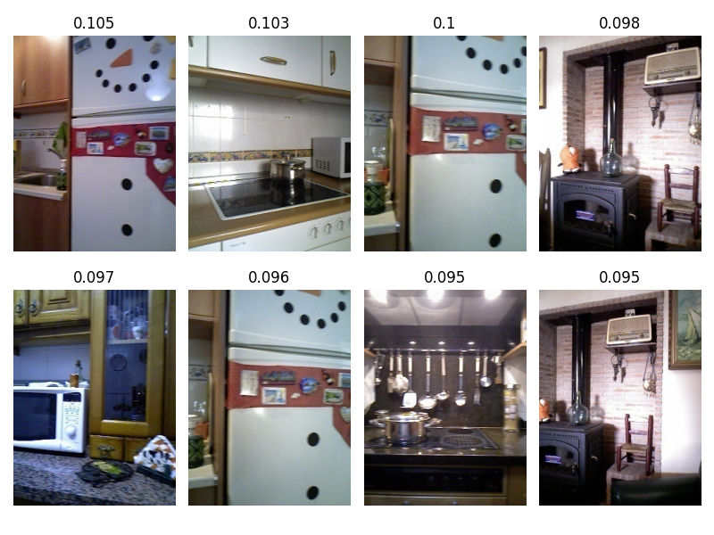
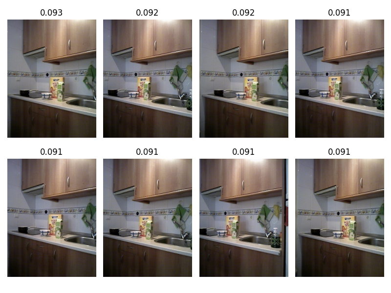
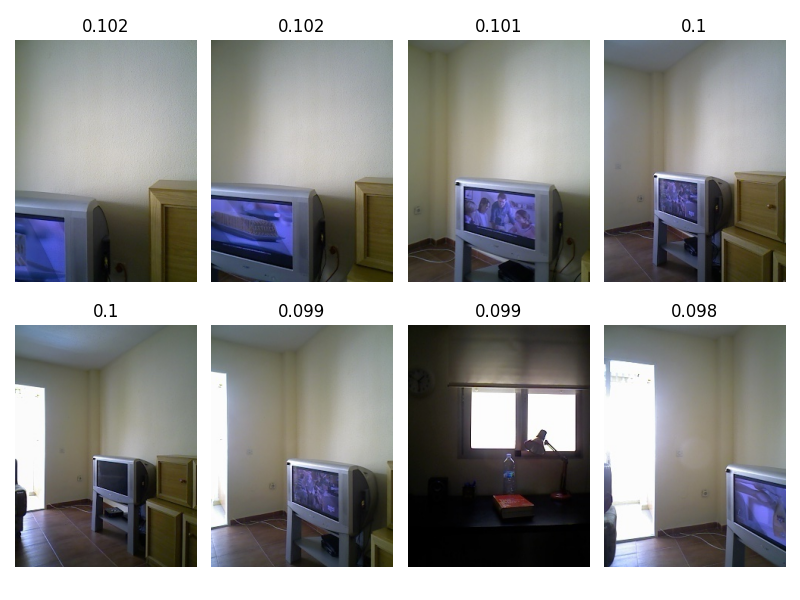
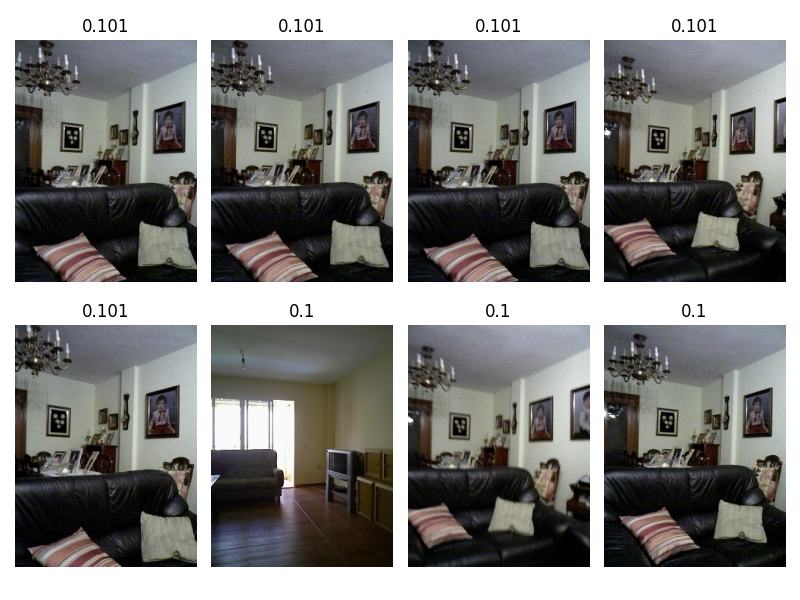